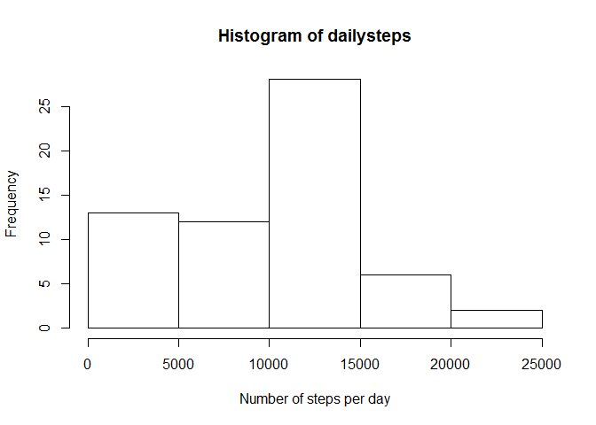
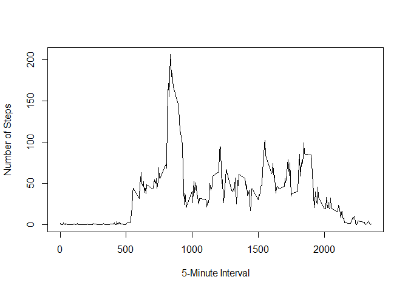
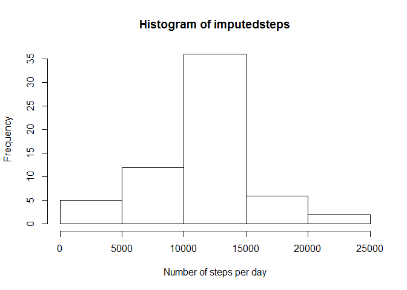
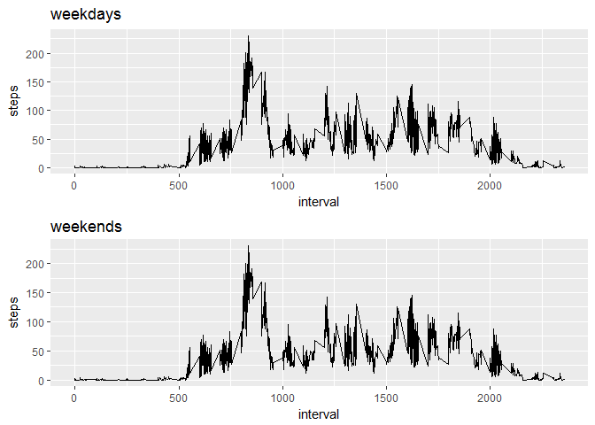

Course Project 1
================
Jared Lounsbery
October 26, 2018

Read the data
-------------

``` r
data <- read.csv("activity.csv", header = TRUE, na.strings = "NA")
data$date <- as.Date(data$date, format = "%Y-%m-%d")
```

Number of steps per day
-----------------------

``` r
dailysteps <- tapply(data$steps, data$date, sum, na.rm=TRUE)
hist(dailysteps, xlab = "Number of steps per day")
```



``` r
dailymean <- mean(dailysteps, na.rm=TRUE)
dailymedian <- median(dailysteps, na.rm=TRUE)
```

The mean daily steps taken is 9354.2295082

The median daily steps taken is 10395

Average Number of Steps per 5-minute interval
---------------------------------------------

``` r
minutesteps <- aggregate(data$steps, by=list(data$interval), mean, na.rm=TRUE)
plot(minutesteps, type="l", xlab = "5-Minute Interval", ylab = "Number of Steps")
```



``` r
maxavgsteps <- minutesteps$Group.1[max(minutesteps$x)]
```

The maximum average number of steps occurs in the 1705th 5-minute of the day

Imputing missing data
---------------------

The number of missing data points is 2304

Number of steps per day with imputed data
-----------------------------------------

``` r
meansteps <- aggregate(data$steps, by=list(data$date), mean, na.rm=TRUE)
datanew <- data

for (i in 1:nrow(data)) {
    if (is.na(data$steps[i]) =="TRUE") {
       datanew$steps[i] = minutesteps$x[minutesteps$Group.1==datanew$interval[i]]
    }
}


imputedsteps <- tapply(datanew$steps, datanew$date, sum, na.rm=TRUE)
hist(imputedsteps, xlab = "Number of steps per day")
```



``` r
imputemeansteps <- mean(imputedsteps, na.rm=TRUE)
imputemediansteps <- median(imputedsteps, na.rm=TRUE)
```

The mean daily steps taken is 1.076618910^{4}

The median daily steps taken is 1.076618910^{4}

As you can see, when we have replaced missing ('NA') data with imputed data based on time intervals, the mean and median daily steps increases.

``` r
library(ggplot2)
```

    ## Warning: package 'ggplot2' was built under R version 3.4.3

``` r
library(gridExtra)
```

    ## Warning: package 'gridExtra' was built under R version 3.4.4

``` r
datanew$daytype <- weekdays(datanew$date)

datanew$daytype[datanew$daytype == "Monday" | 
                datanew$daytype == "Tuesday" | 
                datanew$daytype == "Wednesday"| 
                datanew$daytype == "Thursday"| 
                datanew$daytype == "Friday"] <- "weekday"

datanew$daytype[datanew$daytype == "Saturday" |
                datanew$daytype == "Sunday"] <- "weekend"


weekdaysteps <- aggregate(. ~ interval + daytype, data = datanew, mean, na.rm=TRUE)


plot1 <- with(weekdaysteps[weekdaysteps$daytype=="weekday",], ggplot(data=weekdaysteps,
                                                                     aes(x = interval, y = steps)) +
                                                              geom_line() +
                                                              ggtitle("weekdays"))
plot2 <- with(weekdaysteps[weekdaysteps$daytype=="weekend",], ggplot(data=weekdaysteps,
                                                                     aes(x = interval, y = steps)) +
                                                              geom_line()+
                                                              ggtitle("weekends"))

grid.arrange(plot1, plot2, nrow=2)
```


